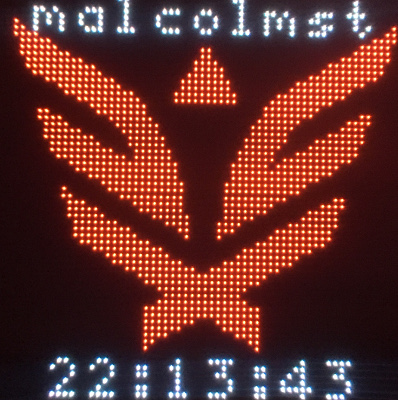
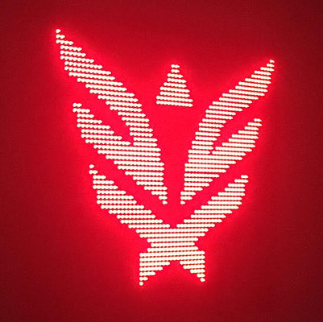
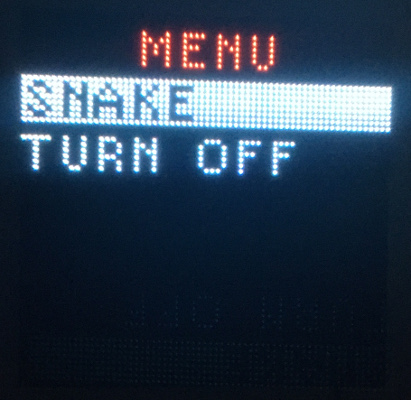
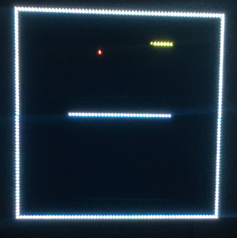

# led-display Python Application Framework

`led-display` is a free Python software framework designed as a user interface for running apps on a 64x64 LED matrix display, though usable with any size of display. It is built on top of the [rpi-rgb-led-matrix](https://github.com/hzeller/rpi-rgb-led-matrix) library. Some of the features include:

- Extensible with your new applications
- Simple graphics and text display, abstracted through the use of controls
- Switch apps via a wireless joystick game controller, a WIP web interface, or a programmatic TCP socket server/client interface
- App customizations via JSON
- Some built-in apps include:
   - Image/logo/clock display
   - Slideshow for picture display
   - Snake game you can play with a joystick

Some of the install scripts and features developed for this framework were added to assist with its use as [Synack Red Team](https://www.synack.com/red-team) swag. However, it is designed to be a customizable framework which can be used for pretty much any purpose. Please feel free to use it in your own projects, and to contribute features, updates, and fixes to it.

## Examples of Use

The LED display (running an earlier version of this framework) has been featured in a [Team SODIUM-24](https://www.sodium24.com/sc2.html) profile for the [DARPA SC2](https://archive.darpa.mil/sc2/) competition:

It will be provided as a swag gift for some exceptional [Synack Red Team](https://www.synack.com/red-team) (SRT) members. Here are some display examples from the swag setup:

## Pairing a Wireless Joystick

See [Pairing a Wireless Joystick](docs/pairing_wireless_joystick.md) for detailed instructions on how to pair your joystick to the display.

## Customizing Settings

See [Customizing Settings](docs/customizing_settings.md) for instructions on how to configure your panel, the framework software, and apps.

## Creating a New App

See [Creating a New App](docs/creating_new_app.md) for instructions on how to add a new app to the framework on your display.
