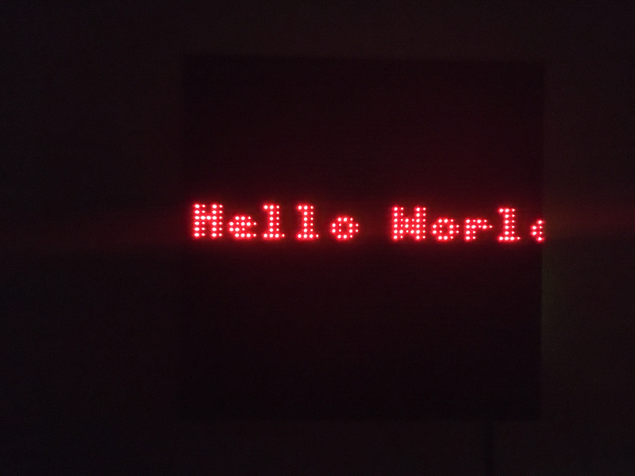

# Creating a New App

Your app can live in the `led-display/led_display/apps` directory. Take a look at some of the other apps there to see how they work.

For example, to create a "Hello World" app, you can do the following:

```bash
$ nano led-display/led_display/apps/hello_world.py
```

```python
from ..app_base import AppBase

class HelloWorld(AppBase):
    def run(self):
        text_control = self.create_control("text", "myTextControl")
        text_control.text = "Hello World!"
        text_control.font = "6x9"
        text_control.x = 32
        text_control.y = 32
        text_control.align = "center"
        text_control.scroll = "auto"
        text_control.color = [255, 0, 0]

        while not self.stop_event.wait(0.1):
            self.update()
            self.draw()
```

Add your app to `addons.py`:

```bash
$ nano led-display/led_display/addons.py
```

Adding:
```python
from .apps.hello_world import HelloWorld
```

```python
apps = {
    "off": DisplayOff,
    "imageDisplay": ImageDisplay,
    "slideshow": Slideshow,
    "menu": Menu,
    "snake": SnakeGame,
    "helloWorld": HelloWorld,
}
```

Add an app configuration:

```bash
$ nano synack_config/apps/hello_world.json
```

```json
{
    "app": "helloWorld",
    "config": {}
}
```

Finally, add it to your screen (assuming your configuration settings are in `synack_config`):

```bash
$ nano synack_config/screen_order.txt
```

```
hello_world
synack_display
menu
```

Now, it is the first app displayed when your sign boots.

Restart the LED display service:

```bash
$ sudo service led-display restart
```



Now you should see your app!
